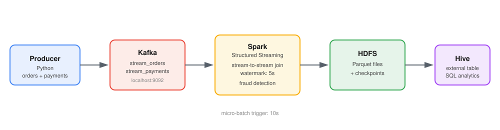

# Real-Time Order & Payment Streaming Pipeline

A fault-tolerant, real-time data pipeline that ingests live order and payment events, joins them in-stream to detect payment mismatches, and persists the enriched results to HDFS as queryable Parquet data via an external Hive table.


## 🛠️ Tech Stack

Python · Apache Kafka · Apache Spark (Structured Streaming) · HDFS · Apache Hive

## 🏗️ Architecture
 


- **Producer**: simulates live order and payment events and publishes them to Kafka
- **Kafka**: buffers two topics — `stream_orders` and `stream_payments`
- **Spark Structured Streaming**: consumes both topics, joins orders to their matching payments within a watermarked time window, enriches the result, and writes it to HDFS
- **Hive**: an external table maps directly onto the HDFS output for SQL analytics

### Why two Kafka topics

Orders and payments are modeled as two separate streams on purpose, so the pipeline can demonstrate a **stream-to-stream join with watermarking** in Spark — matching each order to its payment (if one arrives) within a 5-second window, which is what powers the fraud-detection logic below.

## 🕵️ Fraud Detection Logic

Every order carries an `Expected_amount` (`quantity × price − discount`). When a matching payment arrives within the join window, it's compared against the actual `paid_amount`:

| Condition | Flag |
|---|---|
| `paid_amount` < `Expected_amount` | Haker |
| `paid_amount` > `Expected_amount` | Dafa3 zeada 7elo |
| `paid_amount` == `Expected_amount` | Not haker |

Orders with no matching payment inside the 5-second watermark window are excluded from the join by design — this is standard behavior for late/missing events in a streaming join, not data loss.

## 📦 Data Schemas

### Orders (`stream_orders`)

| Field | Type | Description |
|---|---|---|
| `order_id` | Integer | Auto-incrementing, starting at 1001 |
| `customer_id` | Integer | Random, 100–500 |
| `customer_gender` | String | Raw messy values (`m`, `M`, `male`, `1`, `f`, `F`, `female`, `0`, `UNKNOWN`) — standardized in Spark |
| `product_id` | Integer | Random, 1–50 |
| `quantity` | Integer | Random, 1–5 |
| `price` | Float | Random, $50.00–$500.00 |
| `discount` | Float | Random, $0.00–$20.00 |
| `order_time` | Timestamp | UTC, `YYYY-MM-DD HH:MM:SS` |

### Payments (`stream_payments`)

| Field | Type | Description |
|---|---|---|
| `payment_id` | String | UUID (first 8 chars) |
| `order_id` | Integer | Foreign key to the matching order |
| `payment_method` | String | `Credit_Card`, `PayPal`, or `Wallet` |
| `paid_amount` | Float | Simulated actual payment (may under- or over-pay) |
| `payment_time` | Timestamp | UTC, sent 2–6 seconds after the order |

### Enriched Output (post-join, written to HDFS/Hive)

Adds `Expected_amount`, a mismatch flag, and the mismatch amount/direction on top of the joined order + payment fields.

## 📁 Repository Structure

```
kafka_spark_pipeline/
├── producer/
│   └── generate_orders_payments.py   # Simulates order + payment events
├── spark/
│   └── spark_streaming.py            # Structured Streaming job: ingest, join, enrich, persist
├── hive/
│   └── create_table.sql              # External table DDL + analytical queries
├── scripts/
│   ├── start_pipeline.sh             # Validates services, launches producer + Spark job
│   └── stop_pipeline.sh              # Graceful shutdown, preserves HDFS/checkpoint state
├── HDFS/final/
│   ├── data/                         # Streamed Parquet output
│   └── checkpoint/                   # Spark Structured Streaming checkpoint state
└── README.md
```
